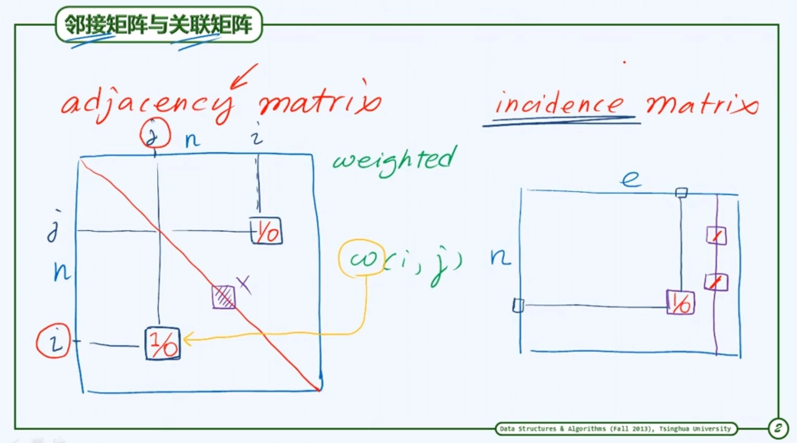
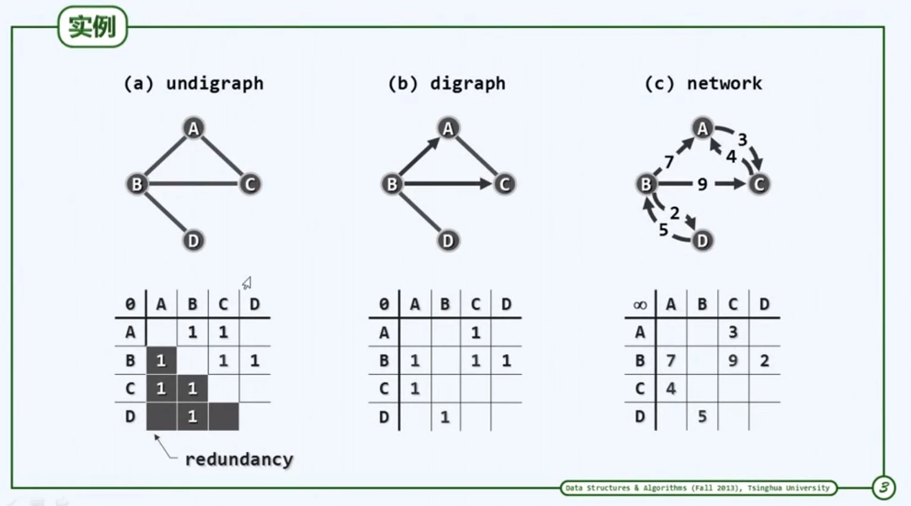

## graph

[TOC]

### 概念

1.  邻接`(adjacency)`  

    两个定点之间存在关系，并且因此存在连接的任意两个点  

2.  关联`(incidence)`  

    参与这个关系的定点与这个关系的关系  

3.  无向图`(undigraph`  

    两个定点$u$, $v$的次序无所谓，则$(u, v)$称为无向边`(unindirected edge)`，所有边均无方向的图，为无向图`(undigraph)`  

4.  有向图`(digraph)`
    所有边均为有向边`(directed edge)`，$u$, $v$，分别称为边$(u, v)$的尾`(tail)`，头`(head)`

5.  图的表示：邻接矩阵和关联矩阵



>   邻接矩阵：点点关系
>   关联矩阵：点边关系

6.  关联矩阵实例



### 图的ADT(抽象接口)

```c++
typedef enum { 
    UNDISCOVERED, // 未被发现
    DISCOVERED,   // 被发现(在队列中)，未访问
    VISITED       // 访问完成
}   vstatus;    // 顶点的状态

typedef enum{
    UNDETERMINED,
    TREE,
    CROSS,
    FORWARD,
    BACKWARD
}   etype;

template<typename Tv, typename Te> class graph
{
private:
    void reset();   // 复位操作
    void BFS(int, int&) // bfs
    void DFS(int, int&);
    void BCC(int, int&, stack<Tv>&);
    bool TSort(int, int&, stack<Tv>*);
    template<typename PU> void PFS(int, PU);

public:
    int n; // 点和点的访问
    virtual Tv&      vertex(int) const = 0;
    virtual int      inDegree(int) const = 0;
    virtual int      outDegree(int) const = 0;
    virtual int&     fTime(int) const = 0;
    virtual int&     dTime(int) const = 0;
    virtual int&     parent(int) const = 0;
    virtual int&     priority(int) const = 0;
    virtual vstatus& status(int) const = 0;
    virtual int firstNbr(int) = 0;
    virtual int nextNbr(int, int) = 0;
    // 点的动态操作
    virtual int      insert (const Tv& ) = 0;
    virtual Tv       remove (int) = 0;

    int e;  // 边和边的访问
    virtual bool     exists(int, int) const = 0;
    virtual etype&   type(int, int) const = 0;
    virtual int&     weight(int, int) const = 0;
    virtual Te&      edge(int, int) const = 0;
    // 边的动态操作
    virtual void     insert(int, int, const Te&, int) = 0;
    virtual Te       remove(int, int) = 0;

    // 图算法
    void bfs(int s);    // 广度优先搜索
    void dfs(int);
    void bcc(int);
    stack<Tv*> tSort(int);
    void prim(int);
    void dijkstra(int);
    template<typename PU> void pfs(int, PU);
}

```

### 邻接矩阵类

#### 顶点类

```c++
template<typename Tv> struct Vertex
{
    Tv data; // 数据
    int in_degree, out_degree;  // 入度，出度，代表有多少边以该点为起点/终点
    vstatus status;
    int dtime, ftime; // 被发现和访问完成的时间
    int parent; // 记录父节点
    int priority; // 优先级
    Vertex(const Tv& d = (Tv)0)
    : data(d), in_degree(0), out_degree(0), status(UNDISCOVERED), dtime(-1), ftime(-1), parent(-1), priority(INT_MAX)
    {}
};
```

#### 边类

```c++
template<typename Te> struct Edge
{
    Te data;
    int weight; // 权重
    etype type; // 类型/状态
    Edge(const Te& d, int w)
    : data(d), weight(w), type(UNDETERMINED)
    {}
}
```

#### 邻接矩阵类

```c++
template<typename Tv, typename Te>
class graph_matrix : public graph<Tv, Te>
{
private:
    vec<Vertex<Tv> > V; // 点集
    vec<vec<Edge<Te>*> > E; // 边集

public:
    graph_matrix()
    : n(0), e(0)
    {}

    ~graph_matrix()
    {
        for(int i = 0; i < n; i++)
            for(int j = 0; j < n; j++)
                delete E[i][j];
    }
    /* ... */
}
```

### 算法

#### BFS

```c++
template<typename Tv, typename Te>
void graph<Tv, Te>::BFS(int v, int& clock)
{
    queue<int> q;  q.enqueue(v);  status(v) = DISCOVERED; // 初始化
    while(!q.empty()){
        v = q.dequeue();  dTime(v) = ++clock;
        for(int u = firstNbr(v); -1 < u; u = nextNbr(v, u)){
            if(status(v) == UNDISCOVERED){
                status(v) = UNDISCOVERED; type(u, v) = TREE;  // 
                parent(u) = v;  q.enqueue(u);
            }
            else
                type(u, v) = CROSS;
        }
        status(v) = VISITED;
    }
}
template<typename Tv, typename Te>
void graph<Tv, Te>::bfs(int s)
{
    int v = s; int clock = 0; reset();
    do{
        if(status(v) == UNDISCOVERED)
            BFS(v, clock);
        v = (++v) % n;
    }while(s != v)
}
```

广度优先搜索，从第一个节点`v`开始，访问`v`的所有邻接节点，然后依次访问`v`的邻接节点的邻接节点。在树结构中相当于层次遍历。

函数`BFS`执行BFS的主要功能，`bfs`判断是否所有顶点都被访问过，从而避免图中存在孤立的连通域。

该算法最终会得到一颗遍历树，称为广度优先搜索树`(BFS树)`。其中`parent(u) = v;`将两个先后访问的顶点进行连接，`type(u, v) = TREE;`将边`(u,v)`放入树中。`type(u, v) = CROSS;` 将边标记为跨边，代表该条边不在遍历树中。