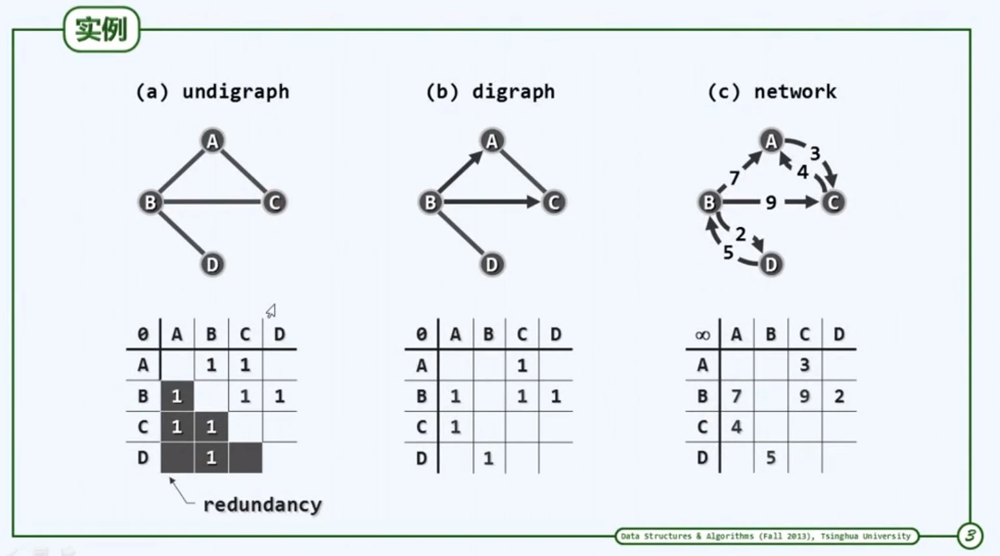

## graph

[TOC]

### 概念

1.  邻接`(adjacency)`  

    两个定点之间存在关系，并且因此存在连接的任意两个点  

2.  关联`(incidence)`  

    参与这个关系的定点与这个关系的关系  

3.  无向图`(undigraph`  

    两个定点$u$, $v$的次序无所谓，则$(u, v)$称为无向边`(unindirected edge)`，所有边均无方向的图，为无向图`(undigraph)`  

4.  有向图`(digraph)`
    所有边均为有向边`(directed edge)`，$u$, $v$，分别称为边$(u, v)$的尾`(tail)`，头`(head)`

5.  图的表示：邻接矩阵和关联矩阵

>   邻接矩阵：点点关系
>   关联矩阵：点边关系

6.  关联矩阵实例

